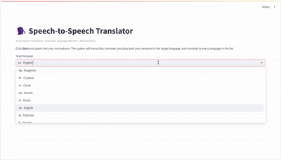

# voice-translator-and-personal-voice

Integrate the Azure Speech service to translate voice with synthesis using Personal Voice.

## Prerequisites

- Python 3.10+
- An Azure Speech resource (or Azure AI Services resource)

## Installation

```bash
pip install -r requirements.txt
```

## Authentication

The application supports **two authentication methods** (dual mode). Configure your `.env` file using `.env-template` as a reference.

### Option A: API Key (traditional)

Set `SPEECH_KEY` and `SPEECH_REGION` in your `.env`:

```dotenv
SPEECH_KEY=your-speech-service-apikey
SPEECH_REGION=westeurope
```

### Option B: Azure Entra ID (recommended for corporate environments)

When `SPEECH_KEY` is **not set** (or commented out), the app automatically switches to Azure AD token authentication using `DefaultAzureCredential` from the `azure-identity` package.

**Requirements:**

1. Your Azure AI Services / Speech resource must have a **custom subdomain** (e.g. `https://myresource.cognitiveservices.azure.com`). Regional endpoints (`https://westeurope.api.cognitive.microsoft.com`) do **not** support Entra ID.
2. Your user or service principal must have the **"Cognitive Services Speech User"** role assigned on the resource (via Azure Portal > Resource > Access control (IAM) > Add role assignment).
3. You must be logged in: `az login`

```dotenv
# SPEECH_KEY commented out → Entra ID is used
#SPEECH_KEY=...
SPEECH_REGION=westeurope
SPEECH_ENDPOINT=https://myresource.cognitiveservices.azure.com
```

| Variable | API Key mode | Entra ID mode |
|---|---|---|
| `SPEECH_KEY` | ✅ Required | ❌ Not set |
| `SPEECH_REGION` | ✅ Required | ✅ Required |
| `SPEECH_ENDPOINT` | Optional | ✅ Required (custom subdomain) |

## Personal Voice Setup

Create your Personal Voice with `create_personal_voice.py`, configuring these values in `.env`:

- `PROJECT_ID`: a string to identify the project
- `CONSENT_ID`: a string to identify the consent
- `PERSONAL_VOICE_ID`: the id of the personal voice to create
- `CONSENT_FILE_PATH`: the path to the WAV file with the consent sentence
- `VOICE_TALENT_NAME`: the name of the talent that recorded the consent
- `COMPANY_NAME`: your company name

Annotate the `SPEAKER_PROFILE_ID` provided when the Personal Voice is created, as it is needed for synthesis.

## Running the Demos

Set the required target languages in the constant `LANGUAGES`.

### SDK-based demos

These demos use the **Azure Speech SDK** (`azure-cognitiveservices-speech`):

| Demo | Command |
|---|---|
| **Translate one sentence** (text interface) | `python voice_translator_and_personal_voice.py` |
| **Translate one sentence** (web interface) | `streamlit run voice_translator_and_personal_voice_app.py` |
| **Continuous translation** (web interface) | `streamlit run voice_translator_and_personal_voice_continuous_app.py` |
| **Simultaneous translator** (Spanish ↔ selected languages) | `streamlit run simultaneous_translator_app.py` |
| **Simultaneous translator multi-language** (Spanish ↔ all languages) | `streamlit run "simultaneous_translator_app (MULTI-IDIOMA).py"` |

### WebSocket-based demo (No SDK)

This demo uses **raw WebSocket + REST API** — no Azure Speech SDK dependency. It connects directly to the Azure Speech Translation WebSocket protocol, giving full control over the wire format and enabling environments where the SDK cannot be installed.

| Demo | Command |
|---|---|
| **Simultaneous translator via WebSocket** (full UI) | `streamlit run simultaneous_translator_ws_app.py` |
| **Minimal console translator** (Spanish ↔ English) | `python simultaneous_translator_ws.py` |

#### `simultaneous_translator_ws.py` — Minimal Console Demo

A stripped-down, **~250-line** version designed as a learning reference for the WebSocket wire protocol. No UI, no SDK, no TTS — just the core translation loop printing to the console.

- **Auth:** API key only (`SPEECH_KEY` + `SPEECH_REGION` in `.env`)
- **Languages:** Spanish ↔ English with automatic detection (`DetectContinuous`)
- **Output:** Live interim hypotheses + final recognised text + translation to the opposite language
- **Streaming translations:** The server sends translations incrementally with every interim hypothesis — this app displays only the final translation for clarity, but the partial translations are available in the same response and could be used for live subtitles
- **Auto-reconnect:** Exponential backoff on disconnect (ping/pong timeout, network drop)
- **Dependencies:** `websocket-client`, `sounddevice`, `numpy`, `python-dotenv`

Example output:
```
  [09:15:24] ✅  [en-US] Hello, how are you?
  [09:15:24] 📝  [es]  → Hola, ¿cómo estás?

  [09:15:31] ✅  [es-ES] Estoy bien, gracias.
  [09:15:31] 📝  [en]  → I'm fine, thank you.
```

> 📖 The source code is heavily commented to explain every step of the WebSocket protocol. See also [`HOW_TO_USE_SPEECH_TRANSLATION_WEBSOCKETS.md`](HOW_TO_USE_SPEECH_TRANSLATION_WEBSOCKETS.md) for the full protocol reference.

#### `simultaneous_translator_ws_app.py` — Full-Featured Demo

**Architecture:**

| Component | Technology |
|---|---|
| Microphone capture | `sounddevice` (PortAudio) — 16 kHz / 16-bit / mono PCM |
| Speech Translation | WebSocket to `wss://{region}.stt.speech.microsoft.com/stt/speech/universal/v2` |
| Text-to-Speech | REST API to `https://{region}.tts.speech.microsoft.com/cognitiveservices/v1` with streaming playback |
| UI | Streamlit |

**Features:**

- 🔄 **Real-time simultaneous translation** — speech is transcribed and translated as you speak
- 🌍 **Automatic language detection** — supports a closed list of up to 10 source languages with continuous detection (`DetectContinuous`)
- 🔒 **Dual authentication** — API Key or Entra ID (with compound token `aad#RESOURCE_ID#TOKEN` for WebSocket and `issueToken` exchange for TTS)
- 🗣️ **Streaming TTS playback** — translated text is synthesized and played back in real time via `sounddevice`
- 🎙️ **Automatic microphone mute/unmute** — mutes the mic during TTS playback to prevent echo feedback (Windows, via `pycaw`)
- 🎭 **Personal Voice support** — can use a cloned voice for TTS output
- 📝 **Live transcription display** — shows interim hypotheses and final translations in the Streamlit UI

**Additional environment variable** (only for WebSocket Entra ID auth):

| Variable | Description |
|---|---|
| `SPEECH_RESOURCE_ID` | Full Azure Resource Manager ID. Required to build the compound auth token for WebSocket. Get it with: `az cognitiveservices account show --name <name> --resource-group <rg> --query id -o tsv` |

> 📖 For a deep-dive into the WebSocket wire protocol, see [`HOW_TO_USE_SPEECH_TRANSLATION_WEBSOCKETS.md`](HOW_TO_USE_SPEECH_TRANSLATION_WEBSOCKETS.md)


